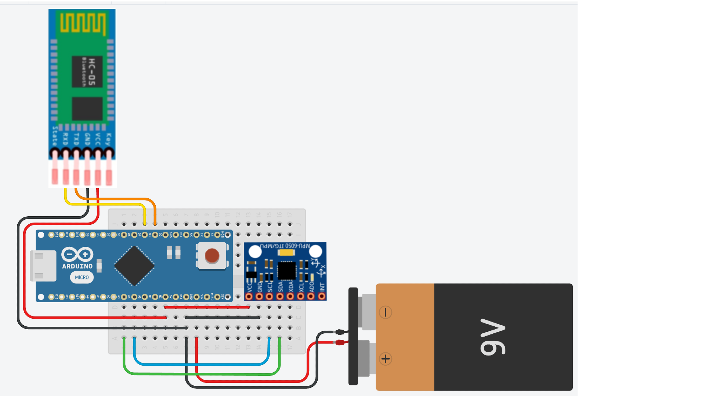

# Rocket Flight Test and Data Logger
This project is a rocket flight test system designed to spin the gyroscope with a DC motor and a microcontroller. The speed and direction of the motor is controlled with a bluetooth module. When building the gyroscope, I had to integrate electronics, programming, and mechanical design while overcoming many different challenges in every process.

<!--- You should comment out all portions of your portfolio that you have not completed yet, as well as any instructions:-->

<!--- This is an HTML comment in Markdown -->
<!--- Anything between these symbols will not render on the published site -->


| **Engineer** | **School** | **Area of Interest** | **Grade** |
|:--:|:--:|:--:|:--:|
| Jairus B | American Canyon High | Mechanical Engineering | Incoming Senior

<!--- **Replace the BlueStamp logo below with an image of yourself and your completed project. Follow the guide [here](https://tomcam.github.io/least-github-pages/adding-images-github-pages-site.html) if you need help.** -->


# Final Milestone

<iframe width="560" height="315" src="https://www.youtube.com/embed/jX32oZjV1kk?si=trR9E7ptVGnPHxqI" title="YouTube video player" frameborder="0" allow="accelerometer; autoplay; clipboard-write; encrypted-media; gyroscope; picture-in-picture; web-share" referrerpolicy="strict-origin-when-cross-origin" allowfullscreen></iframe>

**Description:**
For my final milestone, I connected a bluetooth module to my Arduino. This allowed me to control the motion of my motor and gyroscope with a wireless connection. After that, I created an interface in Visual Studio Code with Python. I utilized Tkinter to create a window with different buttons that correspond to the same inputs that have differing speeds in my Arduino IDE code. 

**Challenges and Triumphs of BSE:**
Coming into BlueStamp Engineering, I had little with eletronics, programming, and designing with CAD. Although there were many other challenges that came along the way, the biggest challenge for me was learning to design with CAD. Most of my project had to be 3D printed, so I had to design each part in Onshape. Despite this issue, I was able to persevere and work through these problems. Once I learned the basics with a few tutorials, I was able to figure out how to CAD and build my project. 

**Key Topics:**
Throughout my time in BlueStamp Engineering, I learned how to program an Arduino and connect electronic components such as motors, sensors, batteries, and Bluetooth modules. I also learned CAD and 3D printing by designing and assembling custom parts for my project. Through testing and troubleshooting, I improved both the mechanical and electrical parts of my design. I also documented my work through code, videos, and a GitHub portfolio.

**Future Aspirations:**
In the future, I hope to study mechanical or aerospace engineering and continue building projects that combine coding, electronics, and design. I want to improve my CAD, programming, and problem-solving skills through more hands-on experiences. I also hope to work on technology related to robotics, transportation, or aerospace. Ultimately, I want to use engineering to create practical solutions that make a meaningful impact.


# Second Milestone

<iframe width="560" height="315" src="https://www.youtube.com/embed/2mdTbg3afOQ?si=Ub_4Ibfs9nyURTU-" title="YouTube video player" frameborder="0" allow="accelerometer; autoplay; clipboard-write; encrypted-media; gyroscope; picture-in-picture; web-share" referrerpolicy="strict-origin-when-cross-origin" allowfullscreen></iframe>

**Description:**
In my second milestone, I powered the rotation of my gyroscope with a DC Motor. I've done this by utilizing 2 gears at a 2:1 rate, motor driver, Arduino UNO microcontroller, and a battery pack with 5 AA batteries. I electrically connected them by hooking up the battery pack to the motor driver, which is connected to the motor and microcontroller, so that enough voltage is provided for the circuit. The motor driver gives enough current to the DC motor, so that it can spin the gear attached to it, which spins the gyroscope via a rod with a gear attached to it. The Arduino serves as like the brain of the system. After I created a program to control different speeds for the motor, I uploaded that code to the Arduino so that it can tell the motor driver how to spin the DC motor depending on what I input. 

The most surprising part of this project was having to learn more about different gear ratios and actually testing them. At first, my initial gear ratio didn't work and my DC motor would stall. After learning about the appropriate number of teeth and gear ratio for my situation, I was able to spin the gyroscope with little to no problems.

**Challenges Overcame:**
The main challenge that I have overcome since the last milestone is getting more comfortable and faster with CAD. Creating new sketches became a lot easier as I got more familiar with Onshape. Also, I got more familiar with my components and was able to identify what was wrong a lot quicker. 

**Next Steps:**
For my final milestone, I need to connect a bluietooth module to my microcontroller, allowing wireless control. Afterwards, I want to create an interface which will make it cleaner to look at and easier to control my motor.  

# First Milestone

<iframe width="560" height="315" src="https://www.youtube.com/embed/KMn0VY9GALc?si=kJGqpZ7F-u1yZTXA" title="YouTube video player" frameborder="0" allow="accelerometer; autoplay; clipboard-write; encrypted-media; gyroscope; picture-in-picture; web-share" referrerpolicy="strict-origin-when-cross-origin" allowfullscreen></iframe>

**Description:**
For my Rocket Flight Test and Data Logger, I plan on attaching a gyroscope to a wooden base. Then I will spin the gyroscope with a motor via a gear connection. Currently, I have a gyroscope attached to vertical wooden supports on top of a wooden base. The gyroscope has 3 main parts: the outer frame, rotating gimbal, and rocket holder. The gimbal and rocket holder rotate around different axes of rotation. Each part is attached to each other with rods that can spin in their slot. To get to this point, I had to glue and screw in two wooden beams to a wooden base. Then, I measured the distance between the beams so that I could design and 3D print each of the main parts and the rods of the gyroscope. Afterwards, I glued each part together since I printed them in half for more precise prints. Once they were all printed, I connected everything with the rods and attached it to the wood. 

**Challenges:**
The first challenge I faced was screwing in the wooden supports onto the base. Since I didn't have power tools, using a screwdriver took longer than expected and I had to make sure I was screwing in the right place.

The main challenge I had was designing each 3D printed part with CAD. I have never used CAD before, so using it took a long time. I used Onshape to create different parts and then put them all into one assembly. I had to learn how to create different shapes, planes, and mates to make sure my gyroscope would fit and rotate how I would want. 

The next challenge I faced was testing different tolerances for my rods. I had to print many different rods with varying diameters so that I could get the right amount of tolerance between the hole and the rod. 

Once I had passed all of these challenges, the only thing left to do was to piece everything together. 

**Next Steps:**
I plan on adding a motor to the side of my gyroscope so that I can spin the gyroscope. I will attach a gear to the motor and it will spin the gear that is attached to one of my rods. After that, I plan on adding bluetooth connection to this motor so that I can control different speeds on a separate interface without a wired connection. After this, I will start thinking about different modifications.
  
# Starter Project Milestone

<iframe width="560" height="315" src="https://www.youtube.com/embed/OiAZoEpLqxg?si=571pmQMK6GmbxzXV" title="YouTube video player" frameborder="0" allow="accelerometer; autoplay; clipboard-write; encrypted-media; gyroscope; picture-in-picture; web-share" referrerpolicy="strict-origin-when-cross-origin" allowfullscreen></iframe>

**Description:**
My starter project was the jitterbug. The project centered around a vibration motor, which allowed the robot to vibrate and move around. It also included two LEDS for lights, and a switch to toggle the power on and off. I spent most of my time soldering each component to the Jitterbug PCB, which improved my soldering skills.

**Challenges:**
The main challenge for me was soldering all of the components onto the Jitterbug PCB. Since some pins were placed very close to each other, I had to take my time soldering. I focused on trying not to connect the solder between each hole, so that it wouldn't short circuit. At the same time, I made sure to cover the entire hole, including the gold-plated border. 

**Next Step:**
With this soldering and robot building knowledge, I look forward to my main project. I hope to apply these skills to the best of my ability.


# Schematics 

**Motor Schematic:**


**IMU Schematic:**



# Arduino IDE Code (For the Motor)

```c++
#include <SoftwareSerial.h>

// HC-06 TX -> Digital Pin 10
// HC-06 RX -> Digital Pin 11
SoftwareSerial bluetooth(10, 11);

// Motor driver pins
const int EN = 5;
const int IN1 = 2;
const int IN2 = 3;

void setup() {

  // Start Serial Monitor
  Serial.begin(9600);

  // Start Bluetooth communication
  bluetooth.begin(9600);

  // Set motor pins as outputs
  pinMode(EN, OUTPUT);
  pinMode(IN1, OUTPUT);
  pinMode(IN2, OUTPUT);

}

void loop() {

  // Check if Bluetooth sent any data
  if (bluetooth.available() > 0) {

    // Read one character from Bluetooth
    char command = bluetooth.read();

    // Forward (Slow)
    if (command == 'F') {

      digitalWrite(IN1, HIGH);
      digitalWrite(IN2, LOW);

      analogWrite(EN, 165);

    }

    // Forward (Fast)
    if (command == 'G') {

      digitalWrite(IN1, HIGH);
      digitalWrite(IN2, LOW);

      analogWrite(EN, 210);

    }

    // Backward (Slow)
    if (command == 'B') {

      digitalWrite(IN1, LOW);
      digitalWrite(IN2, HIGH);

      analogWrite(EN, 165);

    }

    // Backward (Fast)
    if (command == 'H') {

      digitalWrite(IN1, LOW);
      digitalWrite(IN2, HIGH);

      analogWrite(EN, 210);

    }

    // Stop
    if (command == 'S') {

      digitalWrite(IN1, LOW);
      digitalWrite(IN2, LOW);

      analogWrite(EN, 0);

    }

  }

}
```

# Arduino IDE Code (For the Sensor)

```c++
#include <Adafruit_MPU6050.h>
#include <Adafruit_Sensor.h>
#include <Wire.h>
#include <SoftwareSerial.h>

// HC-05 TX -> Arduino D2
// HC-05 RX -> Arduino D3
SoftwareSerial bluetooth(2, 3);

Adafruit_MPU6050 mpu;

const unsigned long UPDATE_INTERVAL_MS = 50;  // 20 updates per second
unsigned long previousUpdate = 0;

void setup() {
  Serial.begin(115200);
  bluetooth.begin(9600);

  Serial.println("Starting MPU6050...");

  if (!mpu.begin()) {
    Serial.println("Failed to find MPU6050");
    bluetooth.println("ERROR");

    while (true) {
      delay(10);
    }
  }

  mpu.setAccelerometerRange(MPU6050_RANGE_16_G);
  mpu.setGyroRange(MPU6050_RANGE_250_DEG);

  // Faster response than 21 Hz
  mpu.setFilterBandwidth(MPU6050_BAND_44_HZ);

  Serial.println("MPU6050 ready");
  bluetooth.println("READY");
}

void loop() {
  unsigned long currentTime = millis();

  if (currentTime - previousUpdate >= UPDATE_INTERVAL_MS) {
    previousUpdate = currentTime;

    sensors_event_t acceleration;
    sensors_event_t gyro;
    sensors_event_t temperature;

    mpu.getEvent(&acceleration, &gyro, &temperature);

    // Compact CSV:
    // AccelX,AccelY,AccelZ,GyroX,GyroY,GyroZ

    bluetooth.print(acceleration.acceleration.x, 2);
    bluetooth.print(",");

    bluetooth.print(acceleration.acceleration.y, 2);
    bluetooth.print(",");

    bluetooth.print(acceleration.acceleration.z, 2);
    bluetooth.print(",");

    bluetooth.print(gyro.gyro.x, 3);
    bluetooth.print(",");

    bluetooth.print(gyro.gyro.y, 3);
    bluetooth.print(",");

    bluetooth.println(gyro.gyro.z, 3);

    // Optional Serial Monitor output
    Serial.print(acceleration.acceleration.x, 2);
    Serial.print(",");

    Serial.print(acceleration.acceleration.y, 2);
    Serial.print(",");

    Serial.print(acceleration.acceleration.z, 2);
    Serial.print(",");

    Serial.print(gyro.gyro.x, 3);
    Serial.print(",");

    Serial.print(gyro.gyro.y, 3);
    Serial.print(",");

    Serial.println(gyro.gyro.z, 3);
  }
}
```

# Python Code (For the Interface)

```c++
import tkinter as tk
from tkinter import ttk, messagebox
import serial
import serial.tools.list_ports
import threading
import queue
import math
import re
import time
from collections import deque


BAUD = 9600
HISTORY_LENGTH = 120
DATA_TIMEOUT = 1.5


class Dashboard:
    def __init__(self, root):
        self.root = root
        self.root.title("Gyroscope Dashboard")
        self.root.geometry("1000x720")
        self.root.minsize(900, 650)

        self.imu = None
        self.motor = None
        self.running = True
        self.imu_queue = queue.Queue()
        self.last_imu_data = 0

        self.gx_history = deque(maxlen=HISTORY_LENGTH)
        self.gy_history = deque(maxlen=HISTORY_LENGTH)
        self.gz_history = deque(maxlen=HISTORY_LENGTH)

        self.latest_gx = 0
        self.latest_gy = 0
        self.latest_gz = 0

        self.build_interface()
        self.refresh_ports()

        self.root.after(20, self.update_imu)
        self.root.after(100, self.draw_graph)
        self.root.after(500, self.check_imu_status)

        self.root.protocol("WM_DELETE_WINDOW", self.close)

    # ========================================================
    # INTERFACE
    # ========================================================

    def build_interface(self):
        tk.Label(
            self.root,
            text="Motor and IMU Dashboard",
            font=("Arial", 22, "bold")
        ).pack(pady=10)

        connection_frame = tk.LabelFrame(
            self.root,
            text="Bluetooth Connections",
            padx=10,
            pady=10
        )
        connection_frame.pack(fill="x", padx=15)

        # HC-05 IMU connection
        tk.Label(
            connection_frame,
            text="HC-05 IMU:"
        ).grid(row=0, column=0, padx=5, pady=5)

        self.imu_port = ttk.Combobox(
            connection_frame,
            width=30,
            state="readonly"
        )
        self.imu_port.grid(row=0, column=1, padx=5)

        tk.Button(
            connection_frame,
            text="Connect",
            command=self.connect_imu
        ).grid(row=0, column=2, padx=5)

        tk.Button(
            connection_frame,
            text="Disconnect",
            command=self.disconnect_imu
        ).grid(row=0, column=3, padx=5)

        self.imu_status = tk.Label(
            connection_frame,
            text="Disconnected",
            fg="red",
            width=22
        )
        self.imu_status.grid(row=0, column=4, padx=5)

        # HC-06 motor connection
        tk.Label(
            connection_frame,
            text="HC-06 Motor:"
        ).grid(row=1, column=0, padx=5, pady=5)

        self.motor_port = ttk.Combobox(
            connection_frame,
            width=30,
            state="readonly"
        )
        self.motor_port.grid(row=1, column=1, padx=5)

        tk.Button(
            connection_frame,
            text="Connect",
            command=self.connect_motor
        ).grid(row=1, column=2, padx=5)

        tk.Button(
            connection_frame,
            text="Disconnect",
            command=self.disconnect_motor
        ).grid(row=1, column=3, padx=5)

        self.motor_status = tk.Label(
            connection_frame,
            text="Disconnected",
            fg="red",
            width=22
        )
        self.motor_status.grid(row=1, column=4, padx=5)

        tk.Button(
            connection_frame,
            text="Refresh Ports",
            command=self.refresh_ports
        ).grid(row=0, column=5, rowspan=2, padx=10)

        main_frame = tk.Frame(self.root)
        main_frame.pack(
            fill="both",
            expand=True,
            padx=15,
            pady=10
        )

        self.build_motor_controls(main_frame)
        self.build_imu_display(main_frame)

        self.raw_label = tk.Label(
            self.root,
            text="Waiting for IMU data...",
            anchor="w"
        )
        self.raw_label.pack(
            fill="x",
            padx=15,
            pady=(0, 8)
        )

    # ========================================================
    # MOTOR CONTROLS
    # ========================================================

    def build_motor_controls(self, parent):
        motor_frame = tk.LabelFrame(
            parent,
            text="Motor Controls",
            padx=15,
            pady=15
        )
        motor_frame.pack(
            side="left",
            fill="y",
            padx=(0, 10)
        )

        self.add_motor_button(
            motor_frame,
            "Forward Fast",
            "G"
        )

        self.add_motor_button(
            motor_frame,
            "Forward Slow",
            "F"
        )

        tk.Button(
            motor_frame,
            text="STOP",
            command=lambda: self.send_motor("S"),
            width=16,
            height=2,
            bg="red",
            fg="white",
            font=("Arial", 13, "bold")
        ).pack(pady=12)

        self.add_motor_button(
            motor_frame,
            "Backward Slow",
            "B"
        )

        self.add_motor_button(
            motor_frame,
            "Backward Fast",
            "H"
        )

        self.motor_message = tk.StringVar(
            value="Motor stopped"
        )

        tk.Label(
            motor_frame,
            textvariable=self.motor_message,
            font=("Arial", 11, "bold")
        ).pack(pady=15)

    def add_motor_button(self, parent, text, command):
        tk.Button(
            parent,
            text=text,
            command=lambda: self.send_motor(command),
            width=16,
            height=2
        ).pack(pady=5)

    # ========================================================
    # IMU DISPLAY
    # ========================================================

    def build_imu_display(self, parent):
        imu_frame = tk.LabelFrame(
            parent,
            text="Live IMU Data",
            padx=12,
            pady=10
        )
        imu_frame.pack(
            side="left",
            fill="both",
            expand=True
        )

        readings = tk.Frame(imu_frame)
        readings.pack(fill="x")

        self.values = {
            "Accel X": tk.StringVar(value="0.00 m/s²"),
            "Accel Y": tk.StringVar(value="0.00 m/s²"),
            "Accel Z": tk.StringVar(value="0.00 m/s²"),
            "Accel Total": tk.StringVar(value="0.00 m/s²"),
            "Gyro X": tk.StringVar(value="0.00°/s"),
            "Gyro Y": tk.StringVar(value="0.00°/s"),
            "Gyro Z": tk.StringVar(value="0.00°/s"),
            "Roll": tk.StringVar(value="0.00°"),
            "Pitch": tk.StringVar(value="0.00°")
        }

        # Acceleration values in one column
        accel_box = tk.LabelFrame(
            readings,
            text="Acceleration",
            padx=15,
            pady=10
        )
        accel_box.grid(
            row=0,
            column=0,
            padx=8,
            sticky="nsew"
        )

        self.add_value_row(
            accel_box,
            "X:",
            self.values["Accel X"],
            0
        )
        self.add_value_row(
            accel_box,
            "Y:",
            self.values["Accel Y"],
            1
        )
        self.add_value_row(
            accel_box,
            "Z:",
            self.values["Accel Z"],
            2
        )
        self.add_value_row(
            accel_box,
            "Total:",
            self.values["Accel Total"],
            3
        )

        # Gyroscope values in one column
        gyro_box = tk.LabelFrame(
            readings,
            text="Gyroscope",
            padx=15,
            pady=10
        )
        gyro_box.grid(
            row=0,
            column=1,
            padx=8,
            sticky="nsew"
        )

        self.add_value_row(
            gyro_box,
            "X:",
            self.values["Gyro X"],
            0
        )
        self.add_value_row(
            gyro_box,
            "Y:",
            self.values["Gyro Y"],
            1
        )
        self.add_value_row(
            gyro_box,
            "Z:",
            self.values["Gyro Z"],
            2
        )

        # Orientation values
        orientation_box = tk.LabelFrame(
            readings,
            text="Orientation",
            padx=15,
            pady=10
        )
        orientation_box.grid(
            row=0,
            column=2,
            padx=8,
            sticky="nsew"
        )

        self.add_value_row(
            orientation_box,
            "Roll:",
            self.values["Roll"],
            0
        )
        self.add_value_row(
            orientation_box,
            "Pitch:",
            self.values["Pitch"],
            1
        )

        readings.columnconfigure(0, weight=1)
        readings.columnconfigure(1, weight=1)
        readings.columnconfigure(2, weight=1)

        graph_header = tk.Frame(imu_frame)
        graph_header.pack(
            fill="x",
            pady=(15, 3)
        )

        tk.Label(
            graph_header,
            text="Gyroscope Rotation Speed",
            font=("Arial", 12, "bold")
        ).pack(side="left")

        tk.Button(
            graph_header,
            text="Clear Graph",
            command=self.clear_graph
        ).pack(side="right")

        tk.Label(
            imu_frame,
            text=(
                "The graph automatically changes scale based on "
                "the recent rotation speed."
            ),
            fg="gray"
        ).pack()

        self.graph = tk.Canvas(
            imu_frame,
            height=350,
            bg="white",
            highlightthickness=1,
            highlightbackground="gray"
        )
        self.graph.pack(
            fill="both",
            expand=True,
            pady=5
        )

    def add_value_row(self, parent, label, variable, row):
        tk.Label(
            parent,
            text=label,
            font=("Arial", 11, "bold")
        ).grid(
            row=row,
            column=0,
            sticky="e",
            padx=5,
            pady=4
        )

        tk.Label(
            parent,
            textvariable=variable,
            width=15,
            anchor="w"
        ).grid(
            row=row,
            column=1,
            sticky="w",
            padx=5,
            pady=4
        )

    # ========================================================
    # BLUETOOTH PORTS
    # ========================================================

    def refresh_ports(self):
        ports = [
            port.device
            for port in serial.tools.list_ports.comports()
        ]

        self.imu_port["values"] = ports
        self.motor_port["values"] = ports

        for port in ports:
            name = port.upper()

            if "HC-05" in name or "HC05" in name:
                self.imu_port.set(port)

            if "HC-06" in name or "HC06" in name:
                self.motor_port.set(port)

    # ========================================================
    # HC-05 IMU CONNECTION
    # ========================================================

    def connect_imu(self):
        port = self.imu_port.get()

        if not port:
            messagebox.showerror(
                "HC-05",
                "Select the HC-05 port."
            )
            return

        if (
            self.motor
            and self.motor.is_open
            and port == self.motor.port
        ):
            messagebox.showerror(
                "Incorrect Port",
                "HC-05 and HC-06 cannot use the same port."
            )
            return

        self.disconnect_imu()

        try:
            connection = serial.Serial(
                port,
                BAUD,
                timeout=0.1
            )

            connection.reset_input_buffer()
            self.imu = connection
            self.last_imu_data = 0

            self.imu_status.config(
                text="Waiting for data",
                fg="orange"
            )

            threading.Thread(
                target=self.read_imu,
                args=(connection,),
                daemon=True
            ).start()

        except serial.SerialException as error:
            messagebox.showerror(
                "HC-05 Error",
                str(error)
            )

    def read_imu(self, connection):
        while (
            self.running
            and self.imu is connection
            and connection.is_open
        ):
            try:
                line = connection.readline().decode(
                    errors="ignore"
                ).strip()

                if line:
                    self.imu_queue.put(line)

            except serial.SerialException:
                break

    def disconnect_imu(self):
        connection = self.imu
        self.imu = None

        if connection:
            try:
                connection.close()
            except serial.SerialException:
                pass

        if hasattr(self, "imu_status"):
            self.imu_status.config(
                text="Disconnected",
                fg="red"
            )

    # ========================================================
    # IMU DATA
    # ========================================================

    def update_imu(self):
        try:
            while True:
                line = self.imu_queue.get_nowait()
                data = self.parse_imu(line)

                if data and self.imu:
                    self.show_imu(data)
                    self.last_imu_data = time.monotonic()

                    self.imu_status.config(
                        text="Connected — data active",
                        fg="green"
                    )

                    self.raw_label.config(
                        text=f"IMU data: {line}"
                    )
                else:
                    self.raw_label.config(
                        text=f"Unrecognized data: {line}"
                    )

        except queue.Empty:
            pass

        if self.running:
            self.root.after(20, self.update_imu)

    def check_imu_status(self):
        if self.imu and self.imu.is_open:
            if self.last_imu_data == 0:
                self.imu_status.config(
                    text="Waiting for data",
                    fg="orange"
                )

            elif (
                time.monotonic() - self.last_imu_data
                > DATA_TIMEOUT
            ):
                self.imu_status.config(
                    text="Connected — data stopped",
                    fg="orange"
                )

        if self.running:
            self.root.after(500, self.check_imu_status)

    def parse_imu(self, line):
        # Compact format:
        # ax,ay,az,gx,gy,gz

        parts = [
            part.strip()
            for part in line.split(",")
        ]

        if len(parts) == 6:
            try:
                return list(map(float, parts))
            except ValueError:
                pass

        # Original labeled format
        number = (
            r"[-+]?"
            r"(?:\d+(?:\.\d*)?|\.\d+)"
            r"(?:[eE][-+]?\d+)?"
        )

        matches = re.findall(
            rf"(AccelX|AccelY|AccelZ|"
            rf"GyroX|GyroY|GyroZ)"
            rf"\s*:\s*({number})",
            line
        )

        values = {
            name: float(value)
            for name, value in matches
        }

        names = [
            "AccelX",
            "AccelY",
            "AccelZ",
            "GyroX",
            "GyroY",
            "GyroZ"
        ]

        if all(name in values for name in names):
            return [
                values[name]
                for name in names
            ]

        return None

    def show_imu(self, data):
        ax, ay, az, gx, gy, gz = data

        # Convert radians/second to degrees/second
        gx = math.degrees(gx)
        gy = math.degrees(gy)
        gz = math.degrees(gz)

        accel_total = math.sqrt(
            ax ** 2 + ay ** 2 + az ** 2
        )

        roll = math.degrees(
            math.atan2(ay, az)
        )

        pitch = math.degrees(
            math.atan2(
                -ax,
                math.sqrt(ay ** 2 + az ** 2)
            )
        )

        self.values["Accel X"].set(
            f"{ax:.2f} m/s²"
        )
        self.values["Accel Y"].set(
            f"{ay:.2f} m/s²"
        )
        self.values["Accel Z"].set(
            f"{az:.2f} m/s²"
        )
        self.values["Accel Total"].set(
            f"{accel_total:.2f} m/s²"
        )

        self.values["Gyro X"].set(
            f"{gx:.2f}°/s"
        )
        self.values["Gyro Y"].set(
            f"{gy:.2f}°/s"
        )
        self.values["Gyro Z"].set(
            f"{gz:.2f}°/s"
        )

        self.values["Roll"].set(
            f"{roll:.2f}°"
        )
        self.values["Pitch"].set(
            f"{pitch:.2f}°"
        )

        self.latest_gx = gx
        self.latest_gy = gy
        self.latest_gz = gz

        self.gx_history.append(gx)
        self.gy_history.append(gy)
        self.gz_history.append(gz)

    # ========================================================
    # HC-06 MOTOR
    # ========================================================

    def connect_motor(self):
        port = self.motor_port.get()

        if not port:
            messagebox.showerror(
                "HC-06",
                "Select the HC-06 port."
            )
            return

        if (
            self.imu
            and self.imu.is_open
            and port == self.imu.port
        ):
            messagebox.showerror(
                "Incorrect Port",
                "HC-05 and HC-06 cannot use the same port."
            )
            return

        self.disconnect_motor()

        try:
            self.motor = serial.Serial(
                port,
                BAUD,
                timeout=0.1
            )

            self.motor_status.config(
                text="Connected",
                fg="green"
            )

        except serial.SerialException as error:
            messagebox.showerror(
                "HC-06 Error",
                str(error)
            )

    def disconnect_motor(self):
        connection = self.motor
        self.motor = None

        if connection:
            try:
                connection.write(b"S")
                connection.close()
            except serial.SerialException:
                pass

        if hasattr(self, "motor_status"):
            self.motor_status.config(
                text="Disconnected",
                fg="red"
            )

    def send_motor(self, command):
        if not self.motor or not self.motor.is_open:
            messagebox.showwarning(
                "Motor",
                "Connect the HC-06 first."
            )
            return

        try:
            self.motor.write(command.encode())

            command_names = {
                "F": "Forward slow",
                "G": "Forward fast",
                "B": "Backward slow",
                "H": "Backward fast",
                "S": "Stopped"
            }

            self.motor_message.set(
                command_names.get(command, command)
            )

        except serial.SerialException:
            self.disconnect_motor()

    # ========================================================
    # GRAPH
    # ========================================================

    def clear_graph(self):
        self.gx_history.clear()
        self.gy_history.clear()
        self.gz_history.clear()

    def draw_graph(self):
        self.graph.delete("all")

        width = max(
            self.graph.winfo_width(),
            500
        )

        height = max(
            self.graph.winfo_height(),
            300
        )

        left = 65
        right = 20
        top = 60
        bottom = 45

        graph_width = width - left - right
        graph_height = height - top - bottom

        all_values = (
            list(self.gx_history)
            + list(self.gy_history)
            + list(self.gz_history)
        )

        if all_values:
            largest = max(
                abs(value)
                for value in all_values
            )
        else:
            largest = 0

        # Automatically adjust the vertical scale
        scale = max(25, largest * 1.15)
        scale = math.ceil(scale / 25) * 25

        # Graph title
        self.graph.create_text(
            width / 2,
            15,
            text="Gyroscope Rotation Speed",
            font=("Arial", 11, "bold")
        )

        # Live legend
        legend_y = 38

        self.graph.create_line(
            left,
            legend_y,
            left + 25,
            legend_y,
            fill="red",
            width=3
        )
        self.graph.create_text(
            left + 32,
            legend_y,
            text=f"X: {self.latest_gx:.1f}°/s",
            anchor="w"
        )

        self.graph.create_line(
            left + 150,
            legend_y,
            left + 175,
            legend_y,
            fill="green",
            width=3
        )
        self.graph.create_text(
            left + 182,
            legend_y,
            text=f"Y: {self.latest_gy:.1f}°/s",
            anchor="w"
        )

        self.graph.create_line(
            left + 300,
            legend_y,
            left + 325,
            legend_y,
            fill="blue",
            width=3
        )
        self.graph.create_text(
            left + 332,
            legend_y,
            text=f"Z: {self.latest_gz:.1f}°/s",
            anchor="w"
        )

        # Horizontal gridlines and Y-axis labels
        y_values = [
            scale,
            scale / 2,
            0,
            -scale / 2,
            -scale
        ]

        for value in y_values:
            y = top + (
                (scale - value)
                / (2 * scale)
            ) * graph_height

            self.graph.create_line(
                left,
                y,
                width - right,
                y,
                fill="#dddddd"
            )

            self.graph.create_text(
                left - 8,
                y,
                text=f"{value:.0f}",
                anchor="e"
            )

        # Vertical gridlines
        for index in range(6):
            x = left + (
                index / 5
            ) * graph_width

            self.graph.create_line(
                x,
                top,
                x,
                height - bottom,
                fill="#eeeeee"
            )

        # Y-axis title
        self.graph.create_text(
            18,
            top + graph_height / 2,
            text="Rotation speed (°/s)",
            angle=90
        )

        # X-axis labels
        self.graph.create_text(
            left,
            height - 22,
            text="Older",
            anchor="w"
        )

        self.graph.create_text(
            width - right,
            height - 22,
            text="Newest",
            anchor="e"
        )

        self.graph.create_text(
            width / 2,
            height - 12,
            text=f"Most recent {HISTORY_LENGTH} readings"
        )

        self.draw_line(
            self.gx_history,
            "red",
            left,
            top,
            graph_width,
            graph_height,
            scale
        )

        self.draw_line(
            self.gy_history,
            "green",
            left,
            top,
            graph_width,
            graph_height,
            scale
        )

        self.draw_line(
            self.gz_history,
            "blue",
            left,
            top,
            graph_width,
            graph_height,
            scale
        )

        if self.running:
            self.root.after(100, self.draw_graph)

    def draw_line(
        self,
        history,
        color,
        left,
        top,
        graph_width,
        graph_height,
        scale
    ):
        values = list(history)

        if len(values) < 2:
            return

        points = []

        for index, value in enumerate(values):
            x = left + (
                index / (len(values) - 1)
            ) * graph_width

            y = top + (
                (scale - value)
                / (2 * scale)
            ) * graph_height

            points.extend([x, y])

        self.graph.create_line(
            points,
            fill=color,
            width=2
        )

    # ========================================================
    # CLOSE
    # ========================================================

    def close(self):
        self.running = False
        self.disconnect_motor()
        self.disconnect_imu()
        self.root.destroy()


root = tk.Tk()
app = Dashboard(root)
root.mainloop()
```


# Bill of Materials

| **Part** | **Note** | **Price** | **Link** |
|:--:|:--:|:--:|:--:|
| Arduino Uno R3 | Program Execution | $16.99 | <a href="https://a.co/d/03OlNw2A"> Link </a> |
| Arduino Nano | Program Execution | $15.99 | <a href="https://a.co/d/02QqXWet"> Link </a> |
| Motor Driver | Motor Control | $6.98 | <a href="https://a.co/d/0hf1RYcP"> Link </a> |
| DC Gear Motor | Rotational motion | $6.99 | <a href="https://a.co/d/03TCnzkl"> Link </a> |
| MPU-6050 | IMU Sensor | $6.99 | <a href="https://a.co/d/05ntPAIi"> Link </a> |
| 5x AA Batteries | Power Supply | $6.49 | <a href="https://www.amazon.com/dp/B00O869KJE?_encoding=UTF8&psc=1&ref_=cm_sw_r_cp_ud_dp_DBBMX484PMC3C4MC11G4_1"> Link </a> |
| 9V Battery | Power Supply | $6.49 | <a href="https://a.co/d/0fOFyqsa"> Link </a> |
| HC-06 Bluetooth Module | Bluetooth Connection | $9.99 | <a href="https://www.amazon.com/dp/B074J5WMH1?ref_=cm_sw_r_cp_ud_dp_GT2T5KTQEW4TFKFG29VG"> Link </a> |
| HC-05 Bluetooth Module | Bluetooth Connection | $9.99 | <a href="https://a.co/d/0eIP06gN"> Link </a> |
| Breadboard | Circuit Assembly | $6.99 | <a href="https://a.co/d/0feYFevcG"> Link </a> |
| L-Brackets & Screws | Holds Wooden Beams Upright | $6.99 | <a href="https://www.amazon.com/dp/B0BLBWZYSQ?ref_=cm_sw_r_cp_ud_dp_KGAC8ZXQFY4A97Z10FT4_1"> Link </a> |
| Plywood | Stability | $18.48 | <a href="https://www.amazon.com/dp/B0CYM54W1S?ref_=cm_sw_r_cp_ud_dp_M3J0GW1763MNSZHPC5SH"> Link </a> |
| Square Wooden Dowels | Vertical Supports| $13.99 | <a href="https://a.co/d/086giWlL"> Link </a> |
| PLA Filament | 3D Print Material | $13.99 | <a href="https://a.co/d/01n8owUR"> Link </a> |

<!---
# Other Resources/Examples
One of the best parts about Github is that you can view how other people set up their own work. Here are some past BSE portfolios that are awesome examples. You can view how they set up their portfolio, and you can view their index.md files to understand how they implemented different portfolio components.
- [Example 1](https://trashytuber.github.io/YimingJiaBlueStamp/)
- [Example 2](https://sviatil0.github.io/Sviatoslav_BSE/)
- [Example 3](https://arneshkumar.github.io/arneshbluestamp/)

To watch the BSE tutorial on how to create a portfolio, click here.
-->

